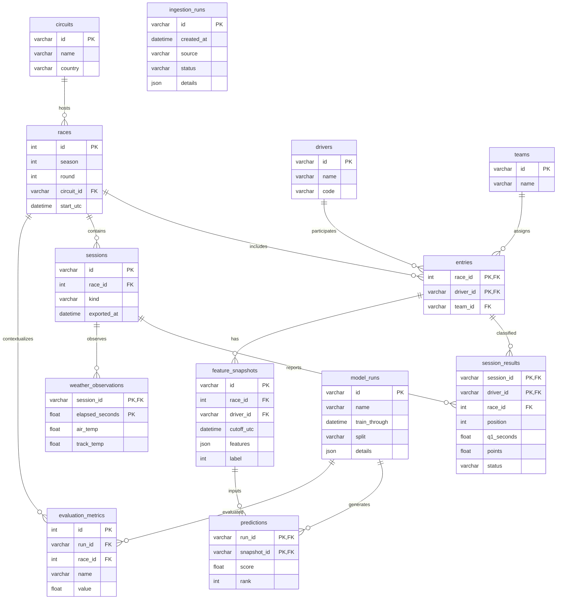

# Cơ sở dữ liệu MySQL của F1 Lab

Schema thực thi ở `sql/schema.sql`; định nghĩa nguồn ở `f1lab/db.py`. Các kiểu thời gian dùng UTC không kèm tz trong MySQL. ID race = season × 100 + round, chỉ dùng cho mùa có dưới 100 vòng.

`ingestion_runs` ghi cả tải thành công/thất bại và đường nguồn trong details; không có FK cứng đến race vì một lần ingest có thể bao phủ cả mùa và một lần lỗi chưa tạo race.

## Vì sao có entries?

Tay đua có thể đổi đội giữa các chặng. Nếu lưu team_id trực tiếp trong drivers và sửa khi chuyển đội, lịch sử đội sẽ sai. Khóa `(race_id, driver_id)` ở entries ghi đội tại lần tham dự đó. Đây là liên kết nhiều–nhiều giữa race và driver, thêm thuộc tính team.

## Ràng buộc quan trọng

- races unique `(season, round)`; sessions unique `(race_id, kind)`.
- session_results có PK `(session_id, driver_id)`, FK ghép đến `(race_id, session_id)` và `(race_id, driver_id)`. Một kết quả không được gắn session race A với người tham dự race B.
- predictions PK `(run_id, snapshot_id)`; mỗi snapshot có một prediction trong một model run.
- CHECK vị trí/rank dương; vị trí thiếu là NULL, không ép bằng 0.
- FK và index được MySQL thực thi; không chỉ vẽ trên ERD.

## Chuẩn hóa và snapshot

Các bảng drivers/teams/circuits lưu thông tin định danh để tránh lặp tên. sessions/results/entries tách vai trò rõ ràng. Feature JSON là snapshot phục vụ tái lập, cố ý giữ bộ đầu vào cụ thể, không dùng thay toàn bộ dữ liệu quan hệ. Label là cột riêng và không vào allowlist feature X.

Dataset CSV của thí nghiệm là bản xuất để chạy/review; nguồn quản lý và lịch sử dự đoán vẫn ở MySQL. Model file lưu trên filesystem, DB lưu đường dẫn và metadata. DB backup không chứa file joblib, vì vậy bundle mang cả hai.

## Nội dung có thể demo

Chạy các truy vấn đọc ở `sql/demo_queries.sql`: JOIN nhiều bảng, GROUP BY đội, view so sánh, thống kê thiếu thời gian Q, window function theo tay đua, và EXPLAIN. Import thực hiện trong transaction; kiểm thử xác minh rollback khi một phiên có dữ liệu trùng. Không có trigger/stored procedure trong v1 vì chưa có nghiệp vụ bắt buộc cần chúng.
