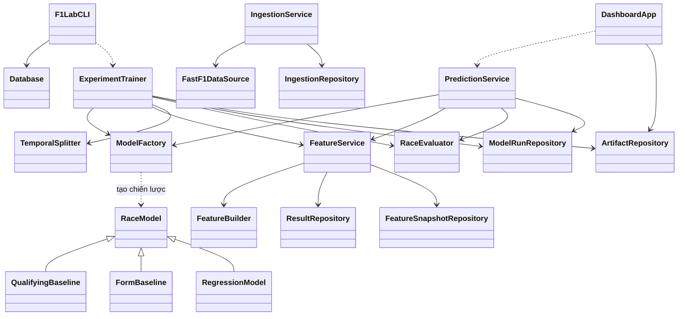

# Kiến trúc OOP của F1 Lab

Dự án chia trách nhiệm thành giao diện, service nghiệp vụ, repository lưu trữ và các chiến lược mô hình. Mục đích là để thay đổi cách thu thập, kiểm thử hay thêm mô hình mà không phải sửa toàn bộ chương trình. Các lệnh chạy trước đây vẫn giữ nguyên.

## 1. Trách nhiệm của các lớp

- `AppConfig` trong `config.py`: cấu hình đường dẫn bất biến; root mặc định là thư mục dự án.
- `Database` trong `db.py`: tạo engine khi cần, giữ pool kết nối và giải phóng bằng `close()`. Các lớp `Driver`, `Race`, `Entry`… là entity SQLAlchemy; schema không thay đổi sau refactor.
- `FastF1DataSource` trong `ingest.py`: truy cập API, phân trang, retry và cache dữ liệu nguồn.
- `IngestionRepository`: chuẩn hóa và lưu dữ liệu trong transaction, giữ kiểm tra trùng tay đua và xung đột đội. `IngestionService` ghép nguồn dữ liệu với repository để thu thập một mùa hoặc thời tiết Q.
- `ResultRepository` trong `repositories.py`: đọc kết quả Q/R đã JOIN với tay đua, đội và chặng.
- `FeatureBuilder` trong `features.py`: tính đầu vào theo cutoff, không truy cập SQL hay ghi file. `FeatureService` đọc qua repository, gọi builder và lưu CSV/quality/snapshot.
- `FeatureSnapshotRepository`: ghi snapshot MySQL. `ModelRunRepository`: ghi lần huấn luyện, dự đoán và metric trong transaction.
- `RaceModel` trong `models.py`: lớp trừu tượng định nghĩa `fit(frame)` và `predict(frame)`.
- `QualifyingBaseline`, `FormBaseline`, `RegressionModel`: các triển khai của `RaceModel`. `ModelFactory` tạo đúng chiến lược và nạp lại estimator đã lưu.
- `TemporalSplitter` trong `ml.py`: chia dữ liệu theo mùa, kiểm tra thời gian và giữ nguyên race. `RaceEvaluator` tạo thứ hạng duy nhất và tính metric theo từng race.
- `ExperimentTrainer`: điều phối validation, chọn phương pháp trước test, lưu kết quả. `TrainingContext` chứa trạng thái của một thí nghiệm; mỗi lần train tạo context riêng.
- `PredictionService`: kiểm tra phiên bản feature và thời gian huấn luyện trước khi tạo/lưu dự đoán.
- `ArtifactRepository`: đọc CSV/model/summary; cập nhật con trỏ latest bằng file tạm. Joblib vẫn lưu estimator của sklearn/CatBoost cùng metadata như trước, nên artifact cũ dùng được.
- `BackupService`, `ReportService`, `BundleService` trong `delivery.py`: sao lưu/khôi phục, xuất báo cáo/schema và đóng gói.
- `F1LabCLI` trong `__main__.py`: nhận tham số, chọn service, đóng pool kết nối sau khi lệnh kết thúc.
- `DashboardApp` trong `web.py`: điều hướng và render năm trang. `app.py` chỉ khởi tạo và gọi `run()`.
- `LocalMySQLManager` trong `scripts/local_mysql.py`: quản lý instance MySQL riêng qua socket và PID của thư mục dự án. `SessionCollector` trong `scripts/collect_session.py`: tải một phiên thực hành, xuất CSV và manifest kể cả khi thiếu một phần dữ liệu.

## 2. Quan hệ giữa các lớp



## 3. Bốn khái niệm OOP trong code

**Đóng gói:** `Database` giữ `_engine`; người gọi dùng property `engine` và phương thức `close()`. Dấu `_` là quy ước nội bộ của Python, không phải cơ chế cấm truy cập tuyệt đối. Repository giữ chi tiết SQL; service gọi phương thức thay vì viết lại câu JOIN.

**Trừu tượng:** `RaceModel` dùng `ABC` và `abstractmethod`. Một lớp mô hình phải triển khai đủ `fit` và `predict` mới khởi tạo được.

**Kế thừa:** hai baseline và `RegressionModel` kế thừa `RaceModel`. Các entity kế thừa `Base` của SQLAlchemy. Service dùng composition vì chúng có trách nhiệm riêng, không phải các dạng của cùng một đối tượng.

**Đa hình:** trainer gọi `strategy.fit(train)` và `strategy.predict(valid)` giống nhau cho cả sáu phương pháp. Baseline trả điểm theo quy tắc; hồi quy học estimator. Trainer không phải phân nhánh theo loại baseline để huấn luyện/chấm điểm.

## 4. Ví dụ dùng các đối tượng

Chạy ví dụ từ thư mục dự án, trong môi trường `.venv`, sau khi đã bật MySQL:

```python
from f1lab.db import Database
from f1lab.features import FeatureService
from f1lab.models import ModelFactory
from f1lab.ml import RaceEvaluator, TemporalSplitter

store = Database()
try:
    frame, quality = FeatureService(store.engine).build_and_save()
    train, valid = TemporalSplitter().split(frame, 2025)
    model = ModelFactory().create("Random Forest").fit(train)
    output = RaceEvaluator().rank(valid, model.predict(valid))
    metrics, per_race = RaceEvaluator().evaluate(output)
    print(metrics)
finally:
    store.close()
```

Ví dụ này phục vụ học OOP; không thay thế giao thức chọn mô hình qua hai mùa validation của `ExperimentTrainer.train()`.

## 5. Truyền dependency để kiểm thử

Constructor của các service nhận source, builder, repository hoặc factory tùy chọn. Mặc định chúng tạo dependency thật. Trong test có thể truyền nguồn trong bộ nhớ và repository ghi nhận lời gọi, nên kiểm tra orchestration mà không cần tải mạng hay sửa database đang demo.

`AppConfig(root=...)` cho phép lưu artifact thí nghiệm kiểm thử trong thư mục tạm. Các test trong `tests/test_oop.py` chạy hợp đồng của cả sáu chiến lược, luồng train/predict, kiểm tra chọn model trước test và so sánh điểm/hạng với toàn bộ artifact đã lưu.

Các hàm cũ như `build_features`, `train_experiment`, `predict_race` còn là adapter tương thích cho notebook/script cũ. CLI và web mới gọi các lớp trực tiếp. Các phép tính nhỏ như đổi thời gian vòng đua, trung bình và định nghĩa DNF vẫn là hàm thuần, vì chúng không cần trạng thái đối tượng.

## 6. Cách mở rộng

Thêm một mô hình: triển khai một `RaceModel` mới hoặc thêm estimator vào factory hồi quy; đăng ký tên trong `ModelFactory.names` và `create()`. Giữ `fit/predict`, feature allowlist và cách chia theo thời gian; đánh giá bằng validation trước khi chốt test mới.

Thay nguồn dữ liệu: truyền đối tượng có `download_year(year, refresh)` vào `IngestionService`. Payload vẫn phải đúng contract mà `IngestionRepository` kiểm tra và lưu.

Thay cách lưu trữ khi kiểm thử: truyền repository có các phương thức service cần. Database chạy thật của ứng dụng vẫn là MySQL.

Các lệnh vẫn như trước:

```bash
python -m f1lab doctor
python -m f1lab features
python -m f1lab train --test-year 2026
python -m f1lab predict --race 202602
python -m streamlit run app.py --server.port 8501
python -m pytest -q --live-db
```


## Mở rộng dự đoán từng phiên

Các lớp WeekendCollector, WeekendRepository, WeekendFeatureBuilder, WeekendTrainer và WeekendPredictionService nằm trong f1lab/weekend.py. WeekendFormModel và WeekendRegressionModel kế thừa RaceModel, nên có cùng hợp đồng fit/predict. Bộ đặc trưng riêng không chứa Q hiện tại. Xem [hướng dẫn từng phiên](DU_DOAN_CUOI_TUAN.md).
